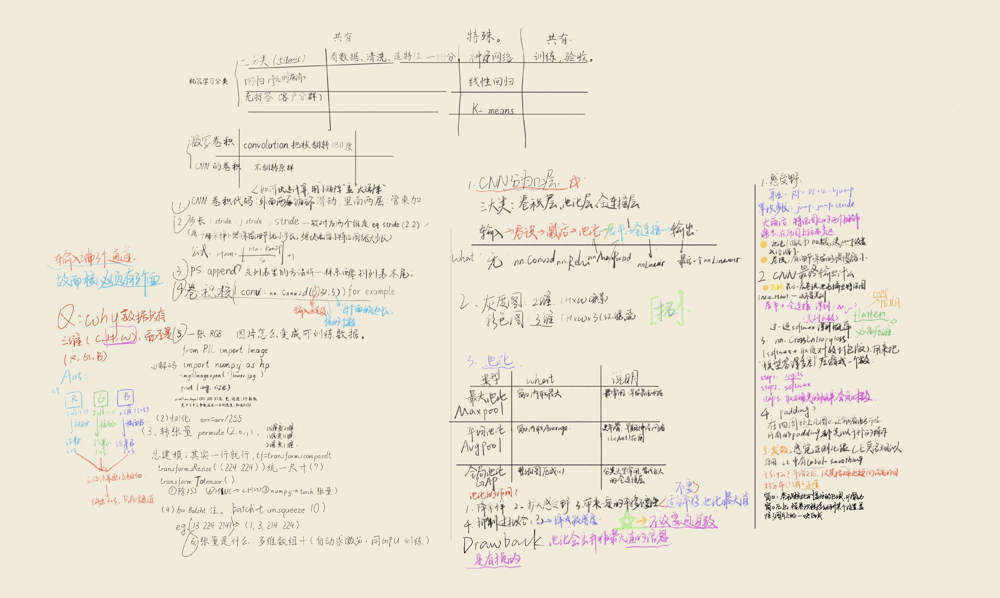
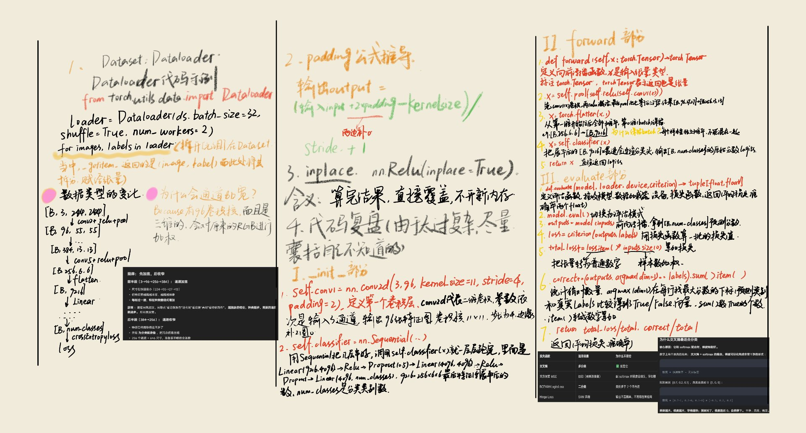

# 花卉小能手

## **初识卷积神经网络**

### Q1*一张RGB三通道彩色图片是如何被处理成可用于训练的数据？张量又是什么？*

- - 读取与维度转换：首先通过PIL、OpenCV等库读入图片，原始图片的存储格式通常是（高, 宽, 通道数），也就是HWC格式，数值范围是0-255的整数，代表每个像素的色彩强度。
  - 维度重排：将通道维度放到最前面，转换为深度学习框架通用的（通道数, 高, 宽）也就是CHW格式，适配卷积层的输入规则。
  - 数值归一化：把0-255的整数像素值除以255，映射到0-1的浮点区间，后续再用数据集预设的均值和标准差做归一化，让像素分布更集中，加快模型梯度收敛速度。
  - 批次拼接：把多张处理好的单张图片堆叠起来，扩展出批次维度，最终得到形状为（批次大小, 通道数, 高, 宽）的四维张量，就可以直接输入神经网络参与训练了。
  - 从维度维度来看，0维张量就是单个标量数值，1维张量等价于我们熟悉的向量，2维张量就是普通矩阵，3维及以上的多维数组都可以统称为张量。
- - 从维度维度来看，0维张量就是单个标量数值，1维张量等价于我们熟悉的向量，2维张量就是普通矩阵，3维及以上的多维数组都可以统称为张量。
  - _和普通Python列表、Numpy数组最大的区别是，张量支持自动微分运算，在模型训练的反向传播过程中，框架可以自动追踪张量的所有运算路径，自动计算每个参数的梯度，不需要人工手动推导求导。_
  - 同时张量可以灵活迁移运算设备，既可以在CPU上运行，也可以直接加载到GPU、NPU等加速硬件上，完成并行化的矩阵运算，大幅提升深度学习的训练和推理速度

### Q2一个卷积神经网络分为哪几层？

- 输入层：这是网络的入口，接收的就是你之前处理好的标准化图像张量，通常形状为（通道数, 图片高, 图片宽），会在这一层完成维度校验、设备对齐，确保数据格式完全匹配后续卷积层的输入要求。
- 卷积层：是CNN的核心特征提取单元，通过多个可学习的卷积核对输入特征图做滑动扫描运算，每一个卷积核会专门抓取一类局部特征，浅层卷积抓边缘、纹理，深层卷积就能组合出抽象的物体轮廓、部件特征，卷积操作自带权值共享特性，大幅减少了全连接网络的参数量。
- 池化层：通常紧跟卷积层之后，用最大值采样或平均值采样的方式对特征图做下采样，在保留核心特征的前提下压缩特征图尺寸，降低后续层的计算量，同时也能让模型对小幅度的物体位移、形变保持一定的鲁棒性。
- 激活层：几乎会插入在每一个卷积层之后，主流使用ReLU等非线性激活函数，打破卷积运算的线性叠加特性，让整个网络具备拟合复杂非线性映射的能力，否则无论堆叠多少层卷积，整体都等价于一层线性变换，无法完成复杂的图像识别任务。
- 全连接层与输出层：位于网络的尾部，会把前面所有层输出的二维特征图展平为一维向量，通过多个全连接层把提取到的全局抽象特征映射到任务标签空间，最后搭配Softmax等输出层，输出分类概率、检测坐标等你需要的最终任务结果。

### Q3什么是卷积，数学严格意义上的卷积和神经网络中的卷积操作有区别吗？卷积核、步长是什么？

- - 卷积本质是一种"加权滑动求和"的运算——用一个固定的小窗口在数据上滑动，每到一处就做一次"对应位置相乘、再全部加起来"的计算，生成一个新的数值序列。它在数学上是对两个函数（或序列）的一种特殊组合方式，在信号处理和神经网络中都有核心地位。
- - 严格来说，神经网络里的"卷积"并不是数学定义上的卷积 ，它更准确的名称是"互相关（cross-correlation）"。两者形式高度相似，但差了一个"翻折"步骤，而且在权重是否可学习、是否为单次求和上也不同。不过在工程语境下，大家已经默认把它叫"卷积"。
  - 设 $f(t)$、$g(t)$ 为两个连续函数，其卷积定义为：
    $$ (f \* g)(t) = \int\_{-\infty}^{+\infty} f(\tau)\, g(t - \tau)\, \mathrm{d}\tau $$
  - 互相关（cross-correlation）定义为：

$$
(f \star g)(t) = \int_{-\infty}^{+\infty} f(\tau)\, g(\tau + t)\, \mathrm{d}\tau
$$

- - 卷积核是那个"滑动的小窗口模板"，它决定了提取什么样的局部特征；步长是这个窗口"每次滑动跳过多少格"，它决定了输出特征图的大小和计算量。二者都属于卷积操作的"超参数/可学习参数"，共同控制着卷积的行为。
    _（详情见笔记）_

> padding 的公式与反推过程，手写稿见文末 **附2**；卷积核 / 步长 / 感受野的手写整理见 **附1**。

### Q4池化有哪些类型，其作用分别有什么？感受野是什么？

---

#### 一、常见池化类型（显然，不可能全部用到）

| 类型                               | 计算方式                           | 特点                   | 典型用途                    |
| ---------------------------------- | ---------------------------------- | ---------------------- | --------------------------- |
| **最大池化（Max Pooling）**        | 取窗口内最大值                     | 保留最显著特征，最常用 | CNN 主干网络默认选择        |
| **平均池化（Average Pooling）**    | 取窗口内平均值                     | 平滑特征，保留整体强度 | 网络末端、GAP               |
| **全局平均池化（GAP）**            | 对整张特征图求均值，输出 1×1       | 无参数，替代全连接层   | 分类网络输出层（如 ResNet） |
| **全局最大池化（GMP）**            | 对整张特征图求最大值               | 强调最强响应           | 分类、注意力分支            |
| **随机池化（Stochastic Pooling）** | 按概率分布随机采样                 | 有正则化效果，抗过拟合 | 训练阶段可替代 Max          |
| **混合池化（Mixed / Max-Avg）**    | 随机或加权组合 Max 和 Avg          | 兼顾两者优点           | 提升泛化能力                |
| **Lp 池化 / 幂平均池化**           | 计算 Lp 范数（p=1 均值，p→∞ 最大） | 可调插值               | 细粒度任务、研究改进        |
| **空间金字塔池化（SPP）**          | 多尺度池化后拼接                   | 输出固定尺寸           | 检测网络（YOLO、SPP-Net）   |
| **ROI 池化 / ROI Align**           | 在候选区域上做池化                 | 处理不同大小候选框     | 目标检测（Faster R-CNN）    |
| **反池化（Unpooling）**            | 按记录位置还原                     | 上采样，恢复空间尺寸   | 语义分割、自编码器          |

---

#### 核心区别

##### 2. 是否有参数

- Max / Avg / GAP 都 **无参数**
- 随机、混合池化训练时依赖概率分布，但非可学习权重

##### 3. 输出尺寸是否固定

- 普通池化依赖输入尺寸
- **SPP、GAP** 可输出固定大小，解决输入尺寸不固定问题

##### 4. 位置敏感性

- Max 对位置较敏感
- Avg 更关注整体分布

##### 5. 应用阶段

- 主干网络中间：Max Pooling 为主
- 输出层：GAP 为主
- 检测任务：ROI Pooling / SPP
- 分割上采样：Unpooling

---

##### 三、池化的作用

1.  **降低特征图尺寸** → 减少计算量和显存占用
2.  **扩大感受野** → 后续卷积能看到更大范围
3.  **保留主要特征** → 过滤冗余信息（尤其 Max）
4.  **提供平移不变性** → 输入小范围位移不影响结果
5.  **防止过拟合** → 减少参数、降低维度
6.  **固定输出尺寸** → 便于接全连接层或分类头（SPP / GAP）

##### 四、Max vs Avg 直观对比

| 对比项   | Max Pooling  | Average Pooling  |
| -------- | ------------ | ---------------- |
| 保留信息 | 最显著特征   | 整体平均水平     |
| 对噪声   | 较敏感       | 更鲁棒           |
| 常用位置 | 主干中间层   | 网络末端 / GAP   |
| 典型网络 | VGG、AlexNet | ResNet 末端、GAP |

- - 感受野 = 输出特征图上某一个点，是由原图（或上一层）多大范围内的像素决定的。 换句话说： 这个点"看到"了原图多大的一块。
- - 决定"看多全局" ：浅层感受野小 → 看细节（边缘、纹理）；深层感受野大 → 看整体（物体、语义）。 2. 指导网络设计 ：想让网络理解大物体，就得堆够层数或加大步长/池化，把感受野撑到和物体差不多大。 3. 堆 3×3 优于用大核 ：两层 3×3 感受野 = 一层 5×5，但 参数更少、非线性更多 （VGG 的核心思想）。

### Q5激活层在此的作用？最后卷积神经网络会输出什么？

- - 核心一句话：没有激活层，叠多少层都等于一层。
  - "线性函数的复合还是线性"。​ 激活层的全部工作，就是把这个性质打破。
- - 输出什么 —— 取决于任务，不取决于网络。​ 分类任务里，它是 (N, K) 的 logits——K 个未归一化的分数，不是概率，argmax 就是答案。

### Q6什么是超参数？如何设定？

- - 超参数是你"设"进去的、控制学习怎么进行的那些旋钮。大致分为，优化类，结构类，正则化类
- - 稳妥起见选择经验值，例如学习率选择1e-3(Adam)
  - 手动调参，一次只改一个
  - 网格搜索，随机搜索（在范围内随机采样）
  - 贝叶斯优化，自动化进阶

### Q7什么是优化器，有哪些类型？

- - 优化器是决定模型怎么更新参数的那套规则，优化器 = 一套"根据梯度，怎么更新参数"的算法。
- - 同样的，下面是优化器的类型，显然也不是所有都常用
    | 优化器 | 核心机制 | 典型场景 | PyTorch 调用 |
    |---|---|---|---|
    | BGD | 全量样本梯度 | 小数据集 | 手写 / `optim.SGD` 全量 |
    | SGD | 单样本梯度 | 理论教学 | `optim.SGD(model.parameters(), lr=0.01)` |
    | Mini-batch SGD | 小批量梯度 | 通用基础 | `optim.SGD(model.parameters(), lr=0.01)` |
    | SGD + Momentum | 加入惯性 | CNN 经典配置 | `optim.SGD(model.parameters(), lr=0.01, momentum=0.9)` |
    | NAG | 预判式动量 | 更稳收敛 | `optim.SGD(model.parameters(), lr=0.01, momentum=0.9, nesterov=True)` |
    | AdaGrad | 累积梯度自适应 | 稀疏特征 | `optim.Adagrad(model.parameters(), lr=0.01)` |
    | RMSProp | 近期梯度自适应 | RNN | `optim.RMSprop(model.parameters(), lr=0.001)` |
    | Adam | 动量 + 自适应 | 默认首选 | `optim.Adam(model.parameters(), lr=1e-3)` |
    | AdamW | Adam + 解耦权重衰减 | Transformer / 大模型 | `optim.AdamW(model.parameters(), lr=1e-3, weight_decay=0.01)` |

### Q8DataLoader 与 DataSet是什么及其使用？

- - Dataset 负责"单个样本怎么取"，DataLoader 负责"一批一批地取"。Dataset 把"取一条"的细节封装起来，DataLoader 只关心"怎么成批"。你换数据源，只改 Dataset，批处理逻辑不用动。
- - Dataset自定义，使用len函数和getitem，分别返回样本总数和第Index个样本，也可以用现成的类，PyTorch 自带两个常用子类， 适合数据在内存里或就是张量时
  - Dataloader 把dataset包装成可迭代批次，核心参数有dataset,batch_size,shuffle,num_workers等，可以进行调用

> 手写整理见文末 **附2**（DataLoader 的创建与取出、维度变化）。

---

## 附：手写稿存档

> 上面这些问题是先在纸上梳理、再落到电子笔记里的。三张手稿一并存档，
> 方便翻回去看当时的推演过程（公式怎么反推、代码接口怎么记）。

### 附1　CNN 方法总览（分类体系 · 卷积 · 池化 · 感受野）

*覆盖：机器学习的分类体系（二分类 / 多分类 / 回归 / 聚类）、共有与特有的处理环节、
CNN 三大类（卷积层 / 池化层 / 全连接层）、卷积核与步长、池化类型对比（最大池化 / 平均池化 / 全局池化）、
感受野与 padding 的作用及公式，以及 `PIL → numpy → Tensor` 的读图代码。对应正文 **Q2 / Q3 / Q4**。*

### 附2　代码接口备忘（Dataset / DataLoader · padding 公式 · forward / evaluate）

*覆盖：`DataLoader` 的创建参数与 `for images, labels in loader` 的取出方式、
张量维度变化（4 类 → 通道 → 图像 → 展平 → 全连接）、`nn.Conv2d` 的 padding 反推过程、
`nn.ReLU(inplace=True)` 的含义（算完直接覆盖，不开新内存）、用 `nn.Sequential` 搭建分类头、
`forward` 的写法，以及 `evaluate` 的实现（`torch.no_grad()` + 累计 `correct/total`）。
对应正文 **Q3 / Q7 / Q8**。*

### 附3　AlexNet 论文读后感

*左侧是论文要点（预处理与数据增强、多 GPU 训练、Local Response Normalization、
重叠池化、5 卷积 + 3 全连接 + Softmax、Dropout、动量 / 权重衰减）。
右侧是个人思考：重叠池化与 LRN 之间的相互制衡、11×11 大卷积核在当时是否必要、
1×1 卷积的作用、以及从 R1×5 到 R1×50 —— 技术是怎么在"主动创新 + 不断试错"里往前走的。
这份感受也解释了我们这个项目为什么值得在 71.28% 之后再往前推一步（见提交报告 5.5）。*
