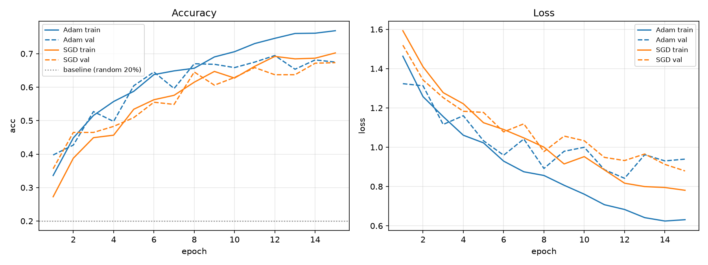
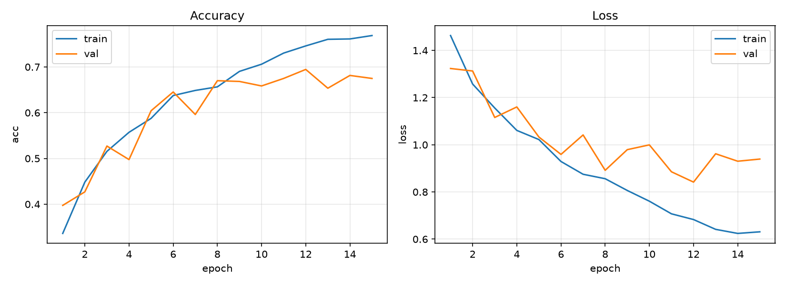
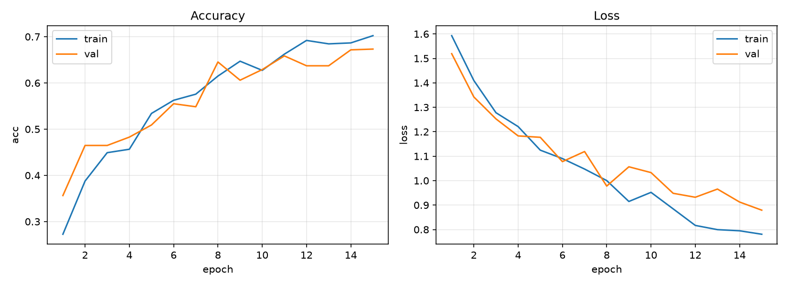

# 花卉图片分类器 · 提交报告

> 一个从零实现的 5 分类 CNN 模型（AlexNet 变体），完整覆盖「数据清洗 → 划分 → 增强 → 建模 → 训练 → 评估」全流程。

| | |
|---|---|
| **提交人** | 何希贤 |
| **方向** | ML（机器学习） |
| **完成日期** | 2026-10-02 |
| **硬件** | NVIDIA GeForce RTX 5060 Laptop GPU |
| **软件** | Windows · Python 3.12.14 · PyTorch 2.14.0+cu130 · torchvision 0.29.1+cu130 |
| **代码位置** | `D:\ML.2`（`src/` 源码 + `docs/` 文档与实验） |

---

## 目录

1. [结论摘要](#一结论摘要)
2. [数据预处理（任务一）](#二数据预处理任务一)
3. [网络结构（任务二）](#三网络结构任务二)
4. [概念问答](#四概念问答)
5. [训练与评估（任务三）](#五训练与评估任务三)
6. [遇到的问题与解决](#六遇到的问题与解决)
7. [附录](#七附录)

---

## 一、结论摘要

| 项目 | 结果 |
|---|---|
| 数据集 | 5 类花卉（daisy / dandelion / rose / sunflower / tulip），原始 3827 张 |
| 坏图处理 | 扫描出 **13 张**损坏图片，全部隔离（不删除）+ 生成 CSV 报告 |
| 数据划分 | train **2425** / val **609**（每类各 20%，分层保持） |
| 输入尺寸 | 统一 `3 × 224 × 224` |
| 数据增强 | RandomHorizontalFlip + RandomRotation(±15°) + ColorJitter |
| 模型规模 | AlexNet 变体，**58,301,829** 个可学习参数 |
| 最优验证准确率 | **69.46%**（Adam, epoch 12） |
| **测试集准确率** | **71.28%**（loss 0.7576） |
| 5 分类随机基线 | 20% |

**一句话结论**：从零训练的 CNN 在 5 类花卉上把准确率从 20%（瞎猜）提升到 **71.28%**。
过程中最大的收获不是这个数字，而是**用对照实验定位了两次"模型不学习"的真实原因**（数据残留、学习率与优化器不配对）—— 详见第六节。

---

## 二、数据预处理（任务一）

### 2.1 数据集概况

题目给定 `train/` 与 `test/` 两个目录，各自按**类别名分子文件夹**（这个结构决定了后面可以直接用 `ImageFolder`，文件夹名即标签）。

| 类别 | 原始 train | 其中坏图 | 清洗后 train | test |
|---|---:|---:|---:|---:|
| daisy | 508 | 2 | 506 | 142 |
| dandelion | 746 | 3 | 743 | 179 |
| rose | 548 | 2 | 546 | 149 |
| sunflower | 522 | 3 | 519 | 131 |
| tulip | 710 | 3 | 707 | 179 |
| **合计** | **3047** | **13** | **3034** | **780** |

> 注：`test/` 目录 780 张**全部完好**，无坏图。

### 2.2 坏图检测与隔离（`src/data/clean.py`）

**问题**：数据集中存在无法打开的图片。如果不在数据加载阶段处理掉，训练中途会直接崩溃。

**方法：两层校验，缺一不可。**

```python
with Image.open(path) as img:
    img.verify()          # 第一层：只校验文件头/校验和，快，抓"伪 jpg、文件头损坏"
with Image.open(path) as img:   # ⚠️ verify() 后文件对象失效，必须重新打开
    img.load()            # 第二层：真正解码全部像素，抓"头正常但数据截断"
```

第一层便宜但会漏（不解码像素），第二层彻底但慢，两层组合才是完整的判定。

**处置原则：原始数据只读，坏图「移动」而非「删除」。**

- 移动到 `data/quarantine/<类名>/`，保留原目录结构，随时可以移回；
- 同时生成 `data/report/bad_files.csv`，逐条记录 `原始路径 / 所属集合 / 错误原因 / 处理动作`；
- 重名时自动加序号，绝不覆盖。

**结果**：合计扫描 3827 张，**发现 13 张坏图，全部集中在 train**，错误类型统一为
`verify失败: UnidentifiedImageError: cannot identify image file`（即文件根本不是合法图片）。
完整清单见附录 `data/report/bad_files.csv`。

### 2.3 训练 / 验证集划分（`src/data/split.py`）

**问题**：题目只给了 train 和 test，但训练过程中需要一个**验证集**来监控泛化、选择超参数。

**策略：按类别循环，在每一类内部按 20% 切分。**

```python
for cls_dir in class_dirs:                       # 逐类
    files = list_class_files(cls_dir)
    train_files, val_files = train_test_split(
        files, test_size=VAL_RATIO, random_state=SEED)   # 类内 8:2
    copy_files(train_files, PROCESSED_DIR / "train" / cls_dir.name)
    copy_files(val_files,   PROCESSED_DIR / "val"   / cls_dir.name)
```

**为什么这样天然就是分层的**：每一类内部都切 8:2，那么整体比例自动保持在 8:2，
**不需要再传 `stratify=y`**。这正是分层抽样的意义 —— 避免某一类被整体切进验证集。

**可复现**：固定 `random_state=SEED`（42），任何人任何时间跑都能得到完全相同的划分结果。

**结果**：

| 类别 | train | val | val 占比 |
|---|---:|---:|---:|
| daisy | 406 | 102 | 20.1% |
| dandelion | 596 | 150 | 20.1% |
| rose | 438 | 110 | 20.1% |
| sunflower | 417 | 105 | 20.1% |
| tulip | 568 | 142 | 20.0% |
| **合计** | **2425** | **609** | **20.1%** |

**工程要点：管道必须「幂等」。**
`copy2` 只覆盖同名文件，**永远不删除多余文件**。如果上一轮跑出的文件这一轮没被同名覆盖到，
它就会一直留在目录里 —— 表现为"数据凭空变多、比例失真"。
因此 `main()` 开头先执行 `reset_output()` 清空旧输出，**保证跑一次和跑十次结果完全一致**。

### 2.4 数据增强（`src/data/transforms.py`）

**问题**：训练样本有限（2425 张），需要扩充有效样本量以抑制过拟合。

**两条铁律**：

1. 增强算子**只加在 `train_transform`** —— 验证/测试集必须"原样"进网络，否则评估结果不可信；
2. 增强要**贴合真实差异**，不能引入现实中不存在的形态。

**选取的 3 个算子**：

| 算子 | 参数 | 模拟的真实差异 |
|---|---|---|
| `RandomHorizontalFlip` | p=0.5 | 拍摄时花朵朝向左右不同 |
| `RandomRotation` | ±15° | 拍摄角度倾斜 |
| `ColorJitter` | brightness/contrast/saturation = 0.2 | 光照条件、相机差异 |

**为什么不做上下翻转（`RandomVerticalFlip`）**：这类数据集的花朵照片基本都是正常拍摄角度，
**倒过来的花在现实中不存在**。加入它相当于给模型灌入"错误的世界知识"——模型可能学到
"倒立 = 某个类"这种伪特征，反而损害泛化。

**验收（自检输出）**：

```
train_transform 形状      : (3, 224, 224)   dtype=torch.float32
train 像素范围            : -2.118 ~ 2.640
同一张图跑两次结果相同吗  : False   <- 必须是 False（随机算子生效）
eval_transform 形状       : (3, 224, 224)
eval 跑两次结果相同吗     : True    <- 必须是 True（验证集无随机污染）
```

### 2.5 尺寸统一（任务 1-4）

CNN 的全连接层要求输入形状固定，因此所有图片统一 `Resize` 到 **224×224**（配合结构图输入）。

归一化采用 ImageNet 的统计值（社区通用基准）：`mean=[0.485, 0.456, 0.406]`，`std=[0.229, 0.224, 0.225]`。

`ToTensor()` 先把像素从 `[0,255]` 压到 `[0,1]`，`Normalize` 再做 `(x − mean) / std`，因此输出的**理论边界**是：

```
最小值 = (0 − mean) / std        最大值 = (1 − mean) / std
R: [−2.118, 2.249]   G: [−2.036, 2.429]   B: [−1.804, 2.640]
合起来: −2.118 ~ 2.640
```

实测一个 batch 的像素范围是 `−2.118 ~ 2.640`，**两端精确打在理论边界上**，说明归一化正确生效。

### 2.6 Dataset 与 DataLoader（`src/data/dataset.py`）

**结构**：`Dataset` 是"仓库"（只管怎么取一条），`DataLoader` 是"卡车"（只管怎么成批、打乱、并发搬货）。
本项目直接用官方现成的 `ImageFolder`（文件夹名 = 标签），自动生成 `class_to_idx`。

```python
train_ds = ImageFolder(PROCESSED_DIR / "train", transform=train_transform)
val_ds   = ImageFolder(PROCESSED_DIR / "val",   transform=eval_transform)
test_ds  = ImageFolder(RAW_TEST_DIR,            transform=eval_transform)  # 坏图已隔离
assert train_ds.class_to_idx == val_ds.class_to_idx == test_ds.class_to_idx

train_loader = DataLoader(train_ds, batch_size=32, shuffle=True,  num_workers=2)
val_loader   = DataLoader(val_ds,   batch_size=32, shuffle=False, num_workers=2)
test_loader  = DataLoader(test_ds,  batch_size=32, shuffle=False, num_workers=2)
```

**核心判断：`shuffle` 怎么填？**

结论：**train=True，val/test=False**。但理由必须分两层说清楚 —— 这是本任务里最值得讲的一个判断：

**（1）为什么训练集必须打乱？**

`ImageFolder` 按**文件夹名排序**装载数据，因此不打乱时数据是**按类别一块一块排着**的。
实测 2425 张训练集、batch_size=32 的组织情况：

| 配置 | 前 12 个 batch 的实际组成 | 单一类别 batch 占比 |
|---|---|---|
| `shuffle=False` | batch 1~12 全部是 `daisy × 32` | **96.1%**（73/76 个 batch 只含一类） |
| `shuffle=True` | `[11,2,9,2,8]`、`[4,2,10,4,12]`、`[5,9,7,3,8]` …（每车五类齐全） | 0% |

**后果**：训练时每个 batch 的梯度决定了参数往哪走。
不打乱 → 每个 batch 的梯度是**单一类别的平均方向**，相当于让模型"先学完雏菊、再学蒲公英…"一段段地掰，
并且会被**最后见到的类别**带偏。打乱之后每个 batch 覆盖五类，模型每一轮都在"同时看五种花"。

**（2）为什么 val/test 不用打乱？**

因为评估时模型参数已经**冻结**，正确率 = 答对数 ÷ 总数，**与取数据的先后顺序天然无关**。
固定顺序反而有个好处：**每次跑看到的错误样本都一样，便于复现和排查**。

> 一句话记法：**打乱顺序不改变「评估」，但改变「学习」。** 分界线在于**参数有没有在更新**。

**规模核实**：

```
train 共 2425 张 / 76 个 batch
val   共 609 张 / 20 个 batch
test  共 780 张 / 25 个 batch
一个 batch: images.shape = (32, 3, 224, 224)
```

---

## 三、网络结构（任务二）

### 3.1 结构图 → PyTorch 代码的翻译规则

只有一条公式：

```
输出边长 = floor( (输入边长 + 2 × padding − kernel) / stride ) + 1
```

结构图上**写明的**（通道数、核大小、步长、每层进出口尺寸）照抄；**没写的**（每层 padding）用公式反推。

**反推三步法**：

1. **抄** —— 从图上抄下 `In / K / S` 和目标 `Out`；
2. **试** —— 把 `P = 0, 1, 2, 3…` 逐个代入，看哪个能让 `Out` 对上；
3. **选** —— 因为公式含**向下取整**，可能有多个 P 同时命中，**取最小的那个**。

也可以直接用反解式一步求出最小值：

```
P_min = ceil( (stride × (Out − 1) − In + kernel) / 2 )
```

### 3.2 逐层尺寸推导

| 层 | 输入 | 配置 | 代入公式 | 输出 | 结构图要求 |
|---|---|---|---|---|---|
| conv1 | 224 | k=11, s=4, **p=2** | ⌊(224+4−11)/4⌋+1 = ⌊54.25⌋+1 | **55** | 55 ✓ |
| pool | 55 | k=3, s=2 | ⌊(55−3)/2⌋+1 | **27** | 27 ✓ |
| conv2 | 27 | k=5, **p=2** | ⌊(27+4−5)/1⌋+1 | **27** | 27 ✓ |
| pool | 27 | k=3, s=2 | ⌊(27−3)/2⌋+1 | **13** | 13 ✓ |
| conv3 | 13 | k=3, **p=1** | ⌊(13+2−3)/1⌋+1 | **13** | 13 ✓ |
| conv4 | 13 | k=3, **p=1** | 同上 | **13** | 13 ✓ |
| conv5 | 13 | k=3, **p=1** | 同上 | **13** | 13 ✓ |
| pool | 13 | k=3, s=2 | ⌊(13−3)/2⌋+1 | **6** | 6 ✓ |
| flatten | 6×6×256 | — | — | **9216** | 9216 ✓ |

**逐层验证（实测输出，9 步全部与结构图一致）**：

```
输入        (1, 3, 224, 224)
conv1 p=2   (1, 96, 55, 55)      pool1  (1, 96, 27, 27)
conv2 p=2   (1, 256, 27, 27)     pool2  (1, 256, 13, 13)
conv3 p=1   (1, 384, 13, 13)     conv4  (1, 384, 13, 13)
conv5 p=1   (1, 256, 13, 13)     pool3  (1, 256, 6, 6)
flatten     9216 = 256 × 6 × 6
```

### 3.3 三个关键点

**① conv1 的"差 1"陷阱。**
直接取 `padding=0` 代入：⌊(224−11)/4⌋+1 = ⌊53.25⌋+1 = **54**，但结构图要 **55** —— 差 1。
这不是图错了，而是**出题人默认第一层做了补边**（这正是 AlexNet 论文中 224/227 输入尺寸争议的来源）。
反解：`P = ⌈(4×54 − 224 + 11)/2⌉ = ⌈1.5⌉ = 2`。
补充：`P=2` 和 `P=3` 代入**都能得到 55**（向下取整导致的），按惯例**取最小的 2**。

**② 池化层可以复用同一个对象。**
池化没有可学习参数（不参与梯度更新），行为完全由 `kernel_size` / `stride` 决定，
因此五个位置共用一个 `self.pool` 与写五份完全等价，能省代码。

**③ 输出维度必须是 5，不是 18。**
结构图末层写的是 18，那是模板残留。本数据集只有 5 类，
**分类头的输出维度必须等于类别数** —— 否则 logits 与标签无法一一对应，损失函数直接报错。
代码里绑到 `config.NUM_CLASSES`，改数据集时只动一处。

### 3.4 参数量核算

| 层 | 计算式 | 参数量 |
|---|---|---:|
| conv1 | 3×96×11×11 + 96 | 34,944 |
| conv2 | 96×256×5×5 + 256 | 614,656 |
| conv3 | 256×384×3×3 + 384 | 885,120 |
| conv4 | 384×384×3×3 + 384 | 1,327,488 |
| conv5 | 384×256×3×3 + 256 | 884,992 |
| fc1 | 9216×4096 + 4096 | 37,752,832 |
| fc2 | 4096×4096 + 4096 | 16,781,312 |
| fc3 | 4096×5 + 5 | 20,485 |
| **合计** | | **58,301,829** |

**结论：卷积层只占 5.2% 的参数，全连接层占了 94.5%。**
这正是 AlexNet 原论文在两个全连接层之间加 `Dropout(p=0.5)` 的原因 —— 参数大户在小数据集上极易过拟合。
本项目沿用该设计。

---

## 四、概念问答

> 完整的逐题回答（含推导、图示、PyTorch 写法）见 `docs/概念题.md`；
> 个人的整理笔记见 `docs/学习笔记.md`。这里给出便于快速浏览的结论摘要。

| 问题 | 核心结论 |
|---|---|
| **Q1 图片如何变成训练数据？张量是什么？** | 读图(HWC, 0–255) → 维度重排为 CHW → 归一化到 `[0,1]` 再标准化 → 堆叠出 batch 维，得到 `(N, C, H, W)`。张量与数组的本质差异是**支持自动微分**和**可迁移到 GPU**。 |
| **Q2 CNN 分哪几层？** | 输入层 / 卷积层（特征提取核心）/ 池化层（下采样）/ 激活层（引入非线性）/ 全连接与输出层。 |
| **Q3 什么是卷积？数学卷积与神经网络卷积的区别？** | 本质是"加权滑动求和"。**严格来说神经网络里是互相关（cross-correlation）**，与数学卷积差一个"翻折"步骤；工程语境已约定俗成叫卷积。卷积核 = 滑动的小窗口模板（决定提取什么特征）；步长 = 每次滑动跳几格（决定输出尺寸与计算量）。 |
| **Q4 池化类型与作用？感受野？** | 常用 Max / Avg / GAP；作用：降尺寸、扩感受野、保主要特征、提供平移不变性、防过拟合、固定输出尺寸。**感受野 = 输出上一个点由原图多大范围决定**；因为"两个 3×3 堆叠的感受野 = 一个 5×5，但参数更少、非线性更多"，所以现在都用小核堆叠。 |
| **Q5 激活层的作用？网络最后输出什么？** | **没有激活层，叠多少层都等于一层**（线性函数的复合仍是线性）。输出取决于任务：分类任务输出 `(N, K)` 的 **logits**（未归一化分数，不是概率），`argmax` 即答案。 |
| **Q6 什么是超参数？如何设定？** | 训练前由人设定、模型自己学不出来的旋钮，分优化类 / 结构类 / 正则化类。设定方法：经验起点 → **控制变量对比实验** → 看曲线调。**绝不能用测试集调参**。 |
| **Q7 什么是优化器？有哪些类型？** | 决定"怎么用梯度更新参数"的算法。SGD → +Momentum → AdaGrad/RMSProp → Adam（动量 + 自适应）。不确定就用 Adam 起步。 |
| **Q8 Dataset 与 DataLoader？** | Dataset 管"怎么取一条"（`__len__` / `__getitem__`），DataLoader 管"怎么成批取"（batch_size / shuffle / num_workers）。换数据源只改 Dataset。 |

---

## 五、训练与评估（任务三）

### 5.1 训练配置

| 超参数 | 取值 | 说明 |
|---|---|---|
| batch_size | 32 | 受显存限制 |
| epochs | 15 | 先跑通再调 |
| 损失函数 | `nn.CrossEntropyLoss()` | 多分类 + 输入 logits，**内部自带 log_softmax**，所以 `forward` 末尾**不加 Softmax** |
| 优化器 | Adam(lr=1e-4) / SGD(lr=1e-2, momentum=0.9) | 见 5.2 对照实验 |
| 随机种子 | 42 | 固定初始权重，保证两组实验可对比 |
| num_workers | 2 | Windows 下需 `if __name__ == "__main__":` 守卫 |

**损失函数的选择依据**：模型输出的是 5 个原始分数（logits），需要一把尺子量它错多少。
尺子只由**任务形态**决定 —— 5 选 1 用 `CrossEntropyLoss`（不是二分类的 `BCEWithLogitsLoss`，也不是回归的 `MSELoss`）。

**训练循环的五个步骤**（顺序不可换）：

```python
for inputs, labels in loader:
    optimizer.zero_grad()               # ① 清梯度 —— backward 是「累加」不是「赋值」
    outputs = model(inputs)             # ② 前向
    loss = criterion(outputs, labels)   # ③ 算损失
    loss.backward()                     # ④ 反向传播，把梯度算到每个参数
    optimizer.step()                    # ⑤ 优化器真正更新参数
```

> ① 为什么必须有：`loss.backward()` 执行的是 `grad += ...`。
> 实测同一个参数连续两次 backward 不清零，梯度从 `2.0` 变成 `5.0`（＝2+3）；清零后才恢复为 `3.0`。

**两处容易漏的开关**：训练前 `model.train()`（打开 Dropout 随机性）、评估前 `model.eval()`（关闭）。
`eval()` 尤其关键 —— 不关的话验证时 Dropout 仍在随机丢弃一半神经元，验证分数会带噪声，
而 `if val_acc > best_val_acc` 保存下来的就成了"**运气最好的那一轮**"，而不是真正最好的模型。

### 5.2 优化器对照实验（三组）

固定随机种子 42，三次训练的初始权重完全相同，**唯一变量是优化器与学习率**。

| # | 配置 | 末轮 train acc | 末轮 val acc | 最佳 val acc | 现象 |
|---|---|---:|---:|---:|---|
| 0 | **SGD lr=1e-4**, momentum=0.9 | 0.2973 | 0.2939 | 0.3186 | ❌ 完全没学到 |
| 1 | **Adam lr=1e-4** | 0.7687 | 0.6749 | **0.6946**（epoch 12） | ✅ 正常收敛，最优 |
| 2 | **SGD lr=1e-2**, momentum=0.9 | 0.7023 | 0.6732 | 0.6732（epoch 15） | ✅ 收敛，略逊于 Adam |



*左：准确率（实线 train / 虚线 val，灰点线为 20% 随机基线）；右：损失。*

**实验 0 的失败诊断（本任务最重要的一次排查）**：

```
epoch  1/15  train loss 1.6099  acc 0.1769 | val loss 1.6098  acc 0.1823
epoch 15/15  train loss 1.6010  acc 0.2973 | val loss 1.6007  acc 0.2939
```

- **loss 15 轮只降了 0.0089**，而 `ln(5) = 1.6094` 正是"五分类瞎猜"的损失值 →
  模型输出几乎仍是均匀分布，**参数压根没被推动过**；
- **train acc (0.2973) ≈ val acc (0.2939)** → 这是**欠拟合**，不是过拟合。
  模型连看过 15 遍的训练集都记不住，说明问题不在数据、不在网络结构。

**根因：学习率与优化器不配对。**

| 优化器 | 怎么决定步长 | 常用 lr |
|---|---|---|
| Adam | 按每个参数的梯度历史**自动缩放**，能吃很小的 lr | 1e-4 ~ 3e-3 |
| SGD | 完全按给定的 lr 走，**没有任何自适应** | 1e-2 ~ 1e-1（配 momentum） |

`lr=1e-4` 是给 Adam 的量级，配给 SGD 相当于"开着没有油门辅助的车只踩 1% 的油门"——差 100 倍。
把 lr 提到 `1e-2` 后（实验 2），SGD 立刻正常工作，验证准确率从 29% 跳到 67%。

**实验结论**：在本任务上 **Adam 略优于 SGD**（最佳 val 0.6946 vs 0.6732），
但差距（约 2 个百分点）远小于"配对正确 vs 配对错误"造成的差距（约 38 个百分点）。
**调参的优先级顺序应当是：先确认超参数之间的适配关系，再去比较谁更优。**

### 5.3 训练曲线

**Adam（实验 1，最优组）**



**SGD lr=1e-2（实验 2）**



**观察**：

1. `val_loss` 从 **epoch 8 起在 0.88~1.00 横盘**，而 `train_loss` 继续下降到 0.63 →
   **这是过拟合的起点**；
2. train 与 val 的准确率差距逐轮扩大（末轮 0.094）→ 已经开始"记"训练集；
3. **val 曲线到第 15 轮仍在缓慢上升** → `EPOCHS=15` 可能偏少，值得试 25 轮；
4. Dropout(0.5) 已经起到了抑制作用（否则 5800 万参数在这个数据量上会迅速过拟合），
   但**进一步的增强或更强的正则**仍有空间。

### 5.4 测试集最终成绩

```
已加载最优模型: D:\ML.2\checkpoints\best_model.pth
最终成绩（test 集）: loss 0.7576, 准确率 0.7128
```

**测试准确率 71.28%**，相对 20% 的随机基线提升 51 个百分点。

> ⚠️ 关于当前 checkpoint：`best_model.pth` 是**最后一次训练**（SGD lr=1e-2 那组）保存的，
> 因为检查点文件名是固定的、每次训练都会被覆盖（Adam 那组权重已被覆盖，但其训练历史已完整保存在
> `docs/logs/history_Adam.json`）。若要提交 Adam 版权重，重跑一次 `train.py` 后再跑 `evaluate.py` 即可。

---

## 六、遇到的问题与解决

这一节记录整个过程中真实踩到的坑。**每一个都指向一条可复用的工程规律。**

### 6.1 `IndentationError: unexpected indent` —— 报错行 ≠ 案发行

**现象**：Python 报第 75 行缩进错误，但第 75 行看起来完全正常。

**根因**：真正的案发地在上游 —— 有 4 行代码被贴到了**第 0 列**（顶格）。
在 Python 里，回到第 0 列意味着"上面所有未闭合的块到此结束"，
于是 `for` 循环和函数一起被提前关闭；等解释器读到后面那个"正常缩进"的 `print` 时，
它已经不在任何块里了，只能把错误指向那里。

**规律**：Python 的**缩进就是 C 的花括号**。判据是：

> **一个块里所有代码行的缩进必须与这个块的第一行完全相同。**
> 动手前先问自己："**我这一行跟哪一行对齐？**"

### 6.2 只有最后一类有数据 —— 循环体边界错误 + 变量作用域

**现象**：划分后 5 个类别里只有 `tulip` 有数据。

**根因**：切分和复制那几行**掉出了 `for` 循环体**（缩进 4 格而非 8 格），
于是循环 5 轮只做了一件事（刷新 `files` 变量），循环结束后才**只执行一次**切分与复制 ——
用的是循环停下时留下的**最后一轮的值**，也就是排序最后的 `tulip`。

**关键认知（与 C 的差异）**：C 里 `for (int i...)` 的循环变量出了循环就没了；
**Python 没有块作用域**，`files` / `cls_dir` 在循环结束后依然活着，保存着**最后一轮的值**。

### 6.3 数据"凭空变多"：tulip 显示 24.4% —— 管道不幂等

**现象**：修正循环体后，其余四类都正好 20%，**只有 tulip 是 24.4%**。

**根因**：`shutil.copy2` 只做两件事 —— **复制、覆盖同名文件**，它**永远不会删除多余的文件**。
上一次跑剩的文件（61+62=123 个）只要这次没被同名覆盖到，就一直躺在目录里，
于是两次运行的结果在同一个目录里**取并集**。

**修法**：在 `main()` 开头加 `reset_output()` —— **先清场，再写盘**。
这条规律叫「**幂等**」：跑一次和跑十次，结果必须完全由输入决定。

### 6.4 `ModuleNotFoundError: No module named 'config'` —— 运行方式决定搜索路径

**现象**：`transforms.py` 单独运行时找不到 `config`，但它一直被 `dataset.py` import 得好好的。

**根因**：`sys.path` 的第一项永远是**被运行的那个脚本自己所在的目录**。

| 运行方式 | `sys.path[0]` | 能否找到 `src/config.py` |
|---|---|---|
| `python src\data\dataset.py` | `src\data` | ❌（除非脚本自己补路径） |
| `dataset.py` 被 import | `src\data`（承袭启动脚本） | ❌ |

`dataset.py` 里有一行 `sys.path.insert(0, ...)` 手动把 `src` 加了进去，所以它能跑；
而它 import 进来的 `transforms.py` 属于**搭便车**，自己单独跑时就暴露了这个洞。

**C 视角**：`sys.path` 就是 Python 的 include 搜索路径 ——
同一份代码 `gcc ma.c` 与 `gcc -I.. ma.c` 结果不同，今天撞的就是这个。

### 6.5 `can't find '__main__' module` —— 给的是目录不是文件

**现象**：执行 `python.exe src\` 报错。

**根因**：给 Python 一个**目录**时，它会把它当成一个**包**，并进去找 `__main__.py`；
而 `src\` 里只有 `__init__.py`。

**关键认知**：**Python 没有"编译整个项目"这回事**（不像 `gcc *.c -o app`），
必须点名到一个具体文件。本项目的总入口只有一个：`src\train.py`。
（C 类比：C 里能不能跑取决于链接器能否找到 `main` 符号；名字不对就报"找不到 main"。）

### 6.6 曲线图右边整块空白 —— 「陈图」陷阱

**现象**：训练完成后生成的 `fig_accuracy_curve.png`，Accuracy 子图有两条线，**Loss 子图整块空白**。
代码复查并模拟运行正确（两个子图各 2 条线）。

**根因**（用文件时间戳钉死）：

```
evaluate.py 保存时间      22:40
训练进程启动时间          ~22:37      ← 早了 3 分钟
曲线图生成时间            22:55       （15 轮 × ~70s ≈ 17 分钟）
```

**Python 在启动时只 import 一次模块。** 进程跑起来之后再改文件，**正在运行的进程毫不知情** ——
它用的还是 import 那一刻的旧版本。

**规律**：**改完代码必须重启进程才生效。**
这与 6.1 / 6.4 属于同一家族 —— "先问清楚这条信息是谁、什么时候、哪一次产生的，再动手"：
① 报错指的行 ≠ 案发行；② 报错来自哪个解释器；③ 报错属于哪一次运行；④ **产物属于哪一次运行**。

**加固措施**：让 `train.py` 把训练历史落盘为 `docs/logs/history_<优化器名>.json`，
并提供 `docs/labs/compare_history.py` 从 json 重画曲线 —— **以后重画图不必重训**。

### 6.7 踩到的一个环境坑

截图里出现的第一行报错用的是 `C:\Users\Henry\AppData\Roaming\uv\python\...\python.exe` ——
**不是项目的虚拟环境**，那个解释器里没有装 torch。
即使脚本路径写对，也会报 `ModuleNotFoundError: No module named 'torch'`，极易被误判成"环境坏了"。

**规矩**：多环境机器上**永远写解释器全路径**，不要裸敲 `python`。

---

## 七、附录

### 7.1 目录结构

```
D:\ML.2\
├── README.md                       项目说明（安装 / 运行 / 结果）
├── requirements.txt                依赖清单
├── .gitignore
├── src\
│   ├── config.py                   全局配置：路径 + 全部超参数（调参只动这里）
│   ├── model.py                    网络结构（AlexNet 变体）
│   ├── train.py                    训练主入口
│   ├── evaluate.py                 评估 + 画曲线
│   └── data\
│       ├── clean.py                任务一 1-1 坏图扫描 / 隔离
│       ├── split.py                任务一 1-2 划分 train / val
│       ├── transforms.py           任务一 1-3 增强 + 1-4 尺寸统一
│       └── dataset.py              任务一 1-5 Dataset / DataLoader
├── tools\
│   └── md_to_pdf.py                文档 md → PDF（用系统自带 Edge 无头模式，零安装）
└── docs\
    ├── 提交报告.md / 提交报告.pdf    本报告
    ├── 训练过程记录.md              三组训练的完整配置、逐轮数据、结论
    ├── 学习过程记录.md              概念理解路径、验证脚本、踩坑与修正
    ├── 概念题.md                    概念问答（详版，含推导与代码）
    ├── 学习笔记.md                  个人整理的笔记（概念问答初稿）
    ├── labs\                       过程验证脚本（见 7.3）
    ├── figures\                    曲线图
    └── logs\                       训练历史 json（逐轮 loss / acc）
```

### 7.2 复现命令

```
cd /d D:\ML.2

D:\ML\.venv_gpu\Scripts\python.exe src\data\clean.py            ① 扫描并隔离坏图
D:\ML\.venv_gpu\Scripts\python.exe src\data\split.py            ② 划分 train / val
D:\ML\.venv_gpu\Scripts\python.exe src\data\dataset.py          ③ 自检数据管道
D:\ML\.venv_gpu\Scripts\python.exe src\model.py                 ④ 自检网络尺寸
D:\ML\.venv_gpu\Scripts\python.exe src\train.py                 ⑤ 训练 + 画曲线
D:\ML\.venv_gpu\Scripts\python.exe src\evaluate.py              ⑥ test 集最终成绩
D:\ML\.venv_gpu\Scripts\python.exe docs\labs\compare_history.py ⑦ 优化器对照图
```

### 7.3 过程验证脚本（`docs/labs/`）

这些脚本是理解每个概念时**用最小实验把机制跑出来**的记录，也是学习过程的一部分。

| 脚本 | 验证了什么 |
|---|---|
| `size_lab.py` | 用真 torch 逐层验算输出尺寸，反推每层 padding（含 conv1 的"差 1"陷阱） |
| `dataloader_lab.py` | 用假数据验证 `batch_size` / `shuffle` / `drop_last` / `num_workers` 各自改变了什么 |
| `train_lab.py` | 验证 `backward()` 是**累加**（所以必须 `zero_grad()`）、`optimizer.step()` 如何改参数、`train()`/`eval()` 的差别 |
| `lr_lab.py` | 固定数据与初始权重，只换优化器与 lr，定位"学不动"的根因 |
| `compare_history.py` | 从落盘的训练历史重画多组对照曲线，不必重训 |

### 7.4 数据与产物清单

| 路径 | 说明 |
|---|---|
| `data/report/bad_files.csv` | 13 张坏图的完整清单与处理动作 |
| `data/quarantine/` | 隔离区（13 张，保留原目录结构，可随时移回） |
| `data/processed/train/` `data/processed/val/` | 划分后的 2425 / 609 张 |
| `checkpoints/best_model.pth` | 最优模型权重（233 MB） |
| `docs/figures/` | 三张曲线图 |
| `docs/logs/` | 各组训练历史（逐轮 train/val 的 loss 与 acc） |

> **仓库提供范围**：上表中 `data/report/bad_files.csv`、`docs/figures/`、`docs/logs/` **随仓库提供**。
> `data/processed/`（168 MB）、`data/quarantine/`、`checkpoints/best_model.pth`（233 MB）
> 因**超过 GitHub 单文件 100 MB 上限**、且都可由管道重建，已在 `.gitignore` 中排除。
> 重建方式（原始数据放在 `D:\BaiduNetdiskDownload\{train,test}` 后依次运行）：
> `src/data/clean.py` → `src/data/split.py` → `src/train.py` → `src/evaluate.py`，
> 详见 `README.md` 的「快速开始」一节。

### 7.5 已知问题与后续改进

1. **检查点未按优化器命名** —— `best_model.pth` 每次训练都会被覆盖，导致 Adam 组的权重丢失。
   改进：把 checkpoint 也按优化器命名（如同 `history_*.json` 的做法）。
2. **`EPOCHS=15` 偏少** —— val 曲线到末轮仍在上升，可试 25 轮。
3. **数据增强仅 3 个算子** —— 可试 `RandomResizedCrop` 替代 `Resize`、或加入更强正则。
4. **未做迁移学习** —— 当前是从零训练；用预训练权重（选做部分 V）预期能大幅提升。
